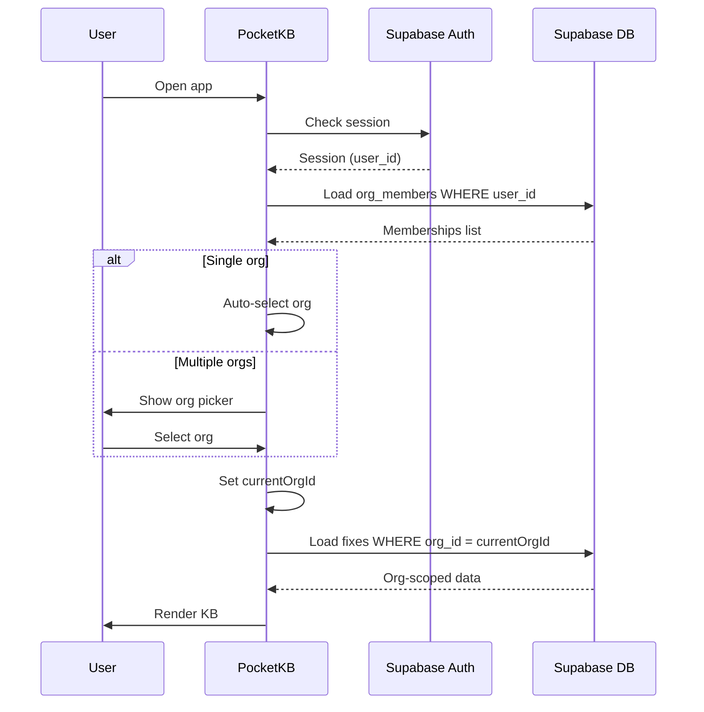

# PocketKB — Multi-Tenant Architecture

> **Design Principle**: One app, many org workspaces, data partitioned by `org_id`.

## Mental Model

PocketKB is **org-centered, user-authenticated, offline-capable, cloud-synced**.

- **Personal** → Solo user creates a "Phil's KB" org (one-person workspace)
- **Team** → Company creates "3 Day Blinds IT" org with shared members
- **SaaS** → Each customer gets their own isolated org

Every important table includes `org_id`. That is the partition key.

---

## 1. Org Model

### `orgs`

| Column | Type | Notes |
|--------|------|-------|
| `id` | `uuid` PK | Default `gen_random_uuid()` |
| `name` | `text` NOT NULL | Display name |
| `slug` | `text` UNIQUE | URL-safe identifier |
| `plan` | `text` | `free`, `team`, `enterprise` |
| `owner_user_id` | `uuid` FK → `auth.users` | Org creator |
| `created_at` | `timestamptz` | Default `now()` |
| `updated_at` | `timestamptz` | Default `now()` |

```sql
CREATE TABLE orgs (
  id            uuid PRIMARY KEY DEFAULT gen_random_uuid(),
  name          text NOT NULL,
  slug          text UNIQUE NOT NULL,
  plan          text DEFAULT 'free',
  owner_user_id uuid REFERENCES auth.users(id),
  created_at    timestamptz DEFAULT now(),
  updated_at    timestamptz DEFAULT now()
);
```

---

## 2. User & Membership Model

### `profiles`

Extends Supabase Auth users with app-specific metadata.

| Column | Type | Notes |
|--------|------|-------|
| `id` | `uuid` PK | Matches `auth.users.id` |
| `display_name` | `text` | |
| `email` | `text` | Denormalized for convenience |
| `avatar_url` | `text` | Optional |
| `created_at` | `timestamptz` | |
| `updated_at` | `timestamptz` | |

```sql
CREATE TABLE profiles (
  id           uuid PRIMARY KEY REFERENCES auth.users(id) ON DELETE CASCADE,
  display_name text,
  email        text,
  avatar_url   text,
  created_at   timestamptz DEFAULT now(),
  updated_at   timestamptz DEFAULT now()
);
```

### `org_members`

The join table that connects users to orgs with role-based access.

| Column | Type | Notes |
|--------|------|-------|
| `id` | `uuid` PK | |
| `org_id` | `uuid` FK → `orgs` | |
| `user_id` | `uuid` FK → `auth.users` | |
| `role` | `text` | `owner`, `admin`, `editor`, `viewer`, `reviewer` |
| `status` | `text` | `active`, `invited`, `suspended` |
| `created_at` | `timestamptz` | |
| `updated_at` | `timestamptz` | |

```sql
CREATE TABLE org_members (
  id         uuid PRIMARY KEY DEFAULT gen_random_uuid(),
  org_id     uuid NOT NULL REFERENCES orgs(id) ON DELETE CASCADE,
  user_id    uuid NOT NULL REFERENCES auth.users(id) ON DELETE CASCADE,
  role       text NOT NULL DEFAULT 'viewer',
  status     text NOT NULL DEFAULT 'active',
  created_at timestamptz DEFAULT now(),
  updated_at timestamptz DEFAULT now(),
  UNIQUE(org_id, user_id)
);
```

### Role Permissions Matrix

| Permission | `owner` | `admin` | `editor` | `reviewer` | `viewer` |
|------------|---------|---------|----------|------------|----------|
| Read fixes | ✅ | ✅ | ✅ | ✅ | ✅ |
| Create fixes | ✅ | ✅ | ✅ | ❌ | ❌ |
| Edit any fix | ✅ | ✅ | own only | ❌ | ❌ |
| Delete fixes | ✅ | ✅ | ❌ | ❌ | ❌ |
| Manage members | ✅ | ✅ | ❌ | ❌ | ❌ |
| Manage org settings | ✅ | ❌ | ❌ | ❌ | ❌ |

---

## 3. Core KB Tables

### `categories`

```sql
CREATE TABLE categories (
  id         uuid PRIMARY KEY DEFAULT gen_random_uuid(),
  org_id     uuid NOT NULL REFERENCES orgs(id) ON DELETE CASCADE,
  name       text NOT NULL,
  icon       text,
  color      text,
  sort_order int DEFAULT 0,
  created_at timestamptz DEFAULT now(),
  updated_at timestamptz DEFAULT now()
);
```

### `fixes`

```sql
CREATE TABLE fixes (
  id            uuid PRIMARY KEY DEFAULT gen_random_uuid(),
  org_id        uuid NOT NULL REFERENCES orgs(id) ON DELETE CASCADE,
  category_id   uuid REFERENCES categories(id) ON DELETE SET NULL,
  title         text NOT NULL,
  summary       text,
  status        text DEFAULT 'published',  -- published, draft, archived
  is_pinned     boolean DEFAULT false,
  author_id     uuid REFERENCES auth.users(id),
  updated_by_id uuid REFERENCES auth.users(id),
  created_at    timestamptz DEFAULT now(),
  updated_at    timestamptz DEFAULT now(),
  deleted_at    timestamptz,               -- soft delete
  version       int DEFAULT 1
);
```

### `fix_steps`

Steps extracted into their own table for granular editing and ordering.

```sql
CREATE TABLE fix_steps (
  id         uuid PRIMARY KEY DEFAULT gen_random_uuid(),
  org_id     uuid NOT NULL REFERENCES orgs(id) ON DELETE CASCADE,
  fix_id     uuid NOT NULL REFERENCES fixes(id) ON DELETE CASCADE,
  step_order int NOT NULL,
  content    text NOT NULL,
  created_at timestamptz DEFAULT now(),
  updated_at timestamptz DEFAULT now()
);
```

### `tags` + `fix_tags`

```sql
CREATE TABLE tags (
  id         uuid PRIMARY KEY DEFAULT gen_random_uuid(),
  org_id     uuid NOT NULL REFERENCES orgs(id) ON DELETE CASCADE,
  name       text NOT NULL,
  color      text,
  created_at timestamptz DEFAULT now(),
  updated_at timestamptz DEFAULT now(),
  UNIQUE(org_id, name)
);

CREATE TABLE fix_tags (
  id     uuid PRIMARY KEY DEFAULT gen_random_uuid(),
  org_id uuid NOT NULL REFERENCES orgs(id) ON DELETE CASCADE,
  fix_id uuid NOT NULL REFERENCES fixes(id) ON DELETE CASCADE,
  tag_id uuid NOT NULL REFERENCES tags(id) ON DELETE CASCADE,
  UNIQUE(fix_id, tag_id)
);
```

### `attachments`

```sql
CREATE TABLE attachments (
  id             uuid PRIMARY KEY DEFAULT gen_random_uuid(),
  org_id         uuid NOT NULL REFERENCES orgs(id) ON DELETE CASCADE,
  fix_id         uuid NOT NULL REFERENCES fixes(id) ON DELETE CASCADE,
  file_path      text NOT NULL,   -- storage path
  file_name      text NOT NULL,
  mime_type      text,
  size_bytes     bigint,
  uploaded_by_id uuid REFERENCES auth.users(id),
  created_at     timestamptz DEFAULT now(),
  updated_at     timestamptz DEFAULT now()
);
```

---

## 4. Offline Sync Model

### `drafts`

Local-first editing with cloud sync tracking.

```sql
CREATE TABLE drafts (
  id          uuid PRIMARY KEY DEFAULT gen_random_uuid(),
  org_id      uuid NOT NULL REFERENCES orgs(id) ON DELETE CASCADE,
  user_id     uuid NOT NULL REFERENCES auth.users(id),
  fix_id      uuid REFERENCES fixes(id),   -- NULL for new fixes
  payload     jsonb NOT NULL,
  sync_status text DEFAULT 'pending',       -- pending, synced, conflict
  created_at  timestamptz DEFAULT now(),
  updated_at  timestamptz DEFAULT now()
);
```

### Sync Queue (Client-Side)

The local sync queue tracks mutations that need to be pushed to the cloud.

| Field | Purpose |
|-------|---------|
| `id` | Local queue entry ID |
| `org_id` | Which workspace this change belongs to |
| `entity_type` | `fix`, `step`, `tag`, `attachment` |
| `entity_id` | UUID of the affected record |
| `action` | `create`, `update`, `delete` |
| `payload` | JSON of the change |
| `status` | `pending`, `syncing`, `done`, `failed` |
| `retry_count` | Number of push attempts |
| `created_at` | When the change was queued |

### Sync Rules

1. **Cloud is source of truth** — local is cache + drafts + queue
2. **Every cached record stores `org_id`** — supports multi-org users
3. **Queue uploads target the correct org context**
4. **Conflicts are resolved cloud-wins** (or flagged for user review)

---

## 5. Storage Paths

All file storage is org-scoped to maintain isolation and organization.

```
orgs/{org_id}/fixes/{fix_id}/screenshot-001.png
orgs/{org_id}/fixes/{fix_id}/screenshot-002.png
orgs/{org_id}/avatars/{user_id}.jpg
```

Supabase Storage bucket: `pocketkb-files` (private, RLS-protected)

---

## 6. RLS Strategy

Every table uses Row Level Security policies based on org membership.

### Core RLS Helper Function

```sql
CREATE OR REPLACE FUNCTION user_org_role(p_org_id uuid)
RETURNS text AS $$
  SELECT role FROM org_members
  WHERE user_id = auth.uid()
    AND org_id = p_org_id
    AND status = 'active'
  LIMIT 1;
$$ LANGUAGE sql SECURITY DEFINER STABLE;
```

### Example Policies

**Read access** — Any active org member can read:

```sql
CREATE POLICY "org_member_read" ON fixes
  FOR SELECT USING (
    EXISTS (
      SELECT 1 FROM org_members
      WHERE org_members.user_id = auth.uid()
        AND org_members.org_id = fixes.org_id
        AND org_members.status = 'active'
    )
  );
```

**Write access** — Editors, admins, owners can create:

```sql
CREATE POLICY "org_editor_insert" ON fixes
  FOR INSERT WITH CHECK (
    user_org_role(org_id) IN ('owner', 'admin', 'editor')
  );
```

**Delete access** — Only admins and owners:

```sql
CREATE POLICY "org_admin_delete" ON fixes
  FOR DELETE USING (
    user_org_role(org_id) IN ('owner', 'admin')
  );
```

> [!IMPORTANT]
> Apply this pattern to **every** org-scoped table: `categories`, `fix_steps`, `tags`, `fix_tags`, `attachments`, `drafts`.

---

## 7. App Flow



### Key Rules

1. **Every query is org-aware**: `WHERE org_id = currentOrgId`
2. **Every new record inherits org**: `new_fix.org_id = currentOrgId`
3. **Org switch reloads all data**: Clear state → reload from new org context

---

## 8. Migration Path from Current Schema

The existing `fixes` table can be migrated by:

1. Create `orgs` table and seed a default org
2. Create `org_members` and link the current user as `owner`
3. Add `org_id` column to `fixes`  (default to the seeded org)
4. Normalize `steps` into `fix_steps`
5. Normalize `tags` into `tags` + `fix_tags`
6. Move `screenshots` array into `attachments`
7. Enable RLS on all tables
8. Update app queries to include `org_id` filters

---

## Locked Design Rules

| # | Rule |
|---|------|
| 1 | Every shared entity gets `org_id` |
| 2 | Users connect to orgs through `org_members` |
| 3 | Cloud is source of truth |
| 4 | Local is cache + drafts + sync queue |
| 5 | RLS is enforced by org membership |
| 6 | Storage paths are org-scoped |
